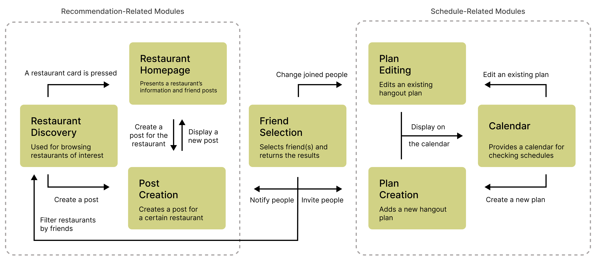
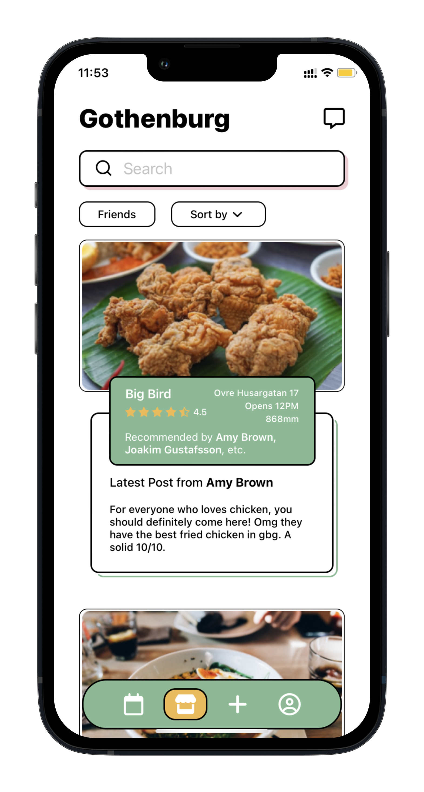
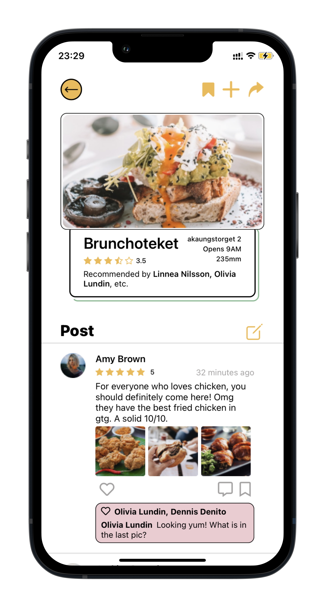
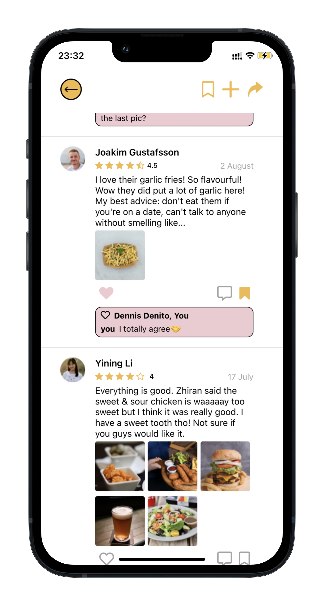
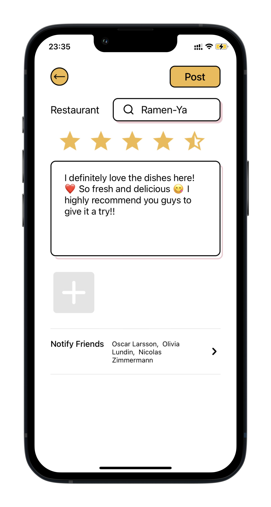
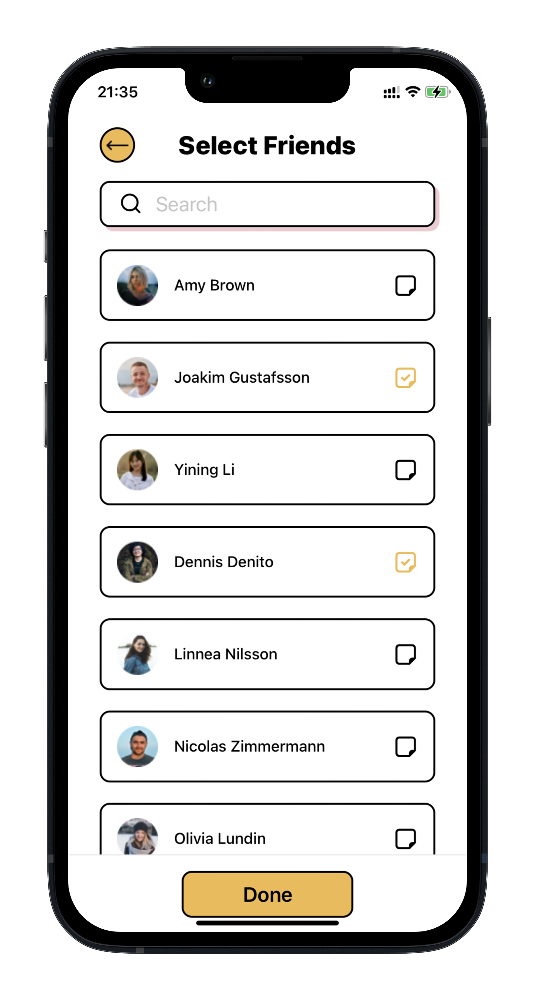
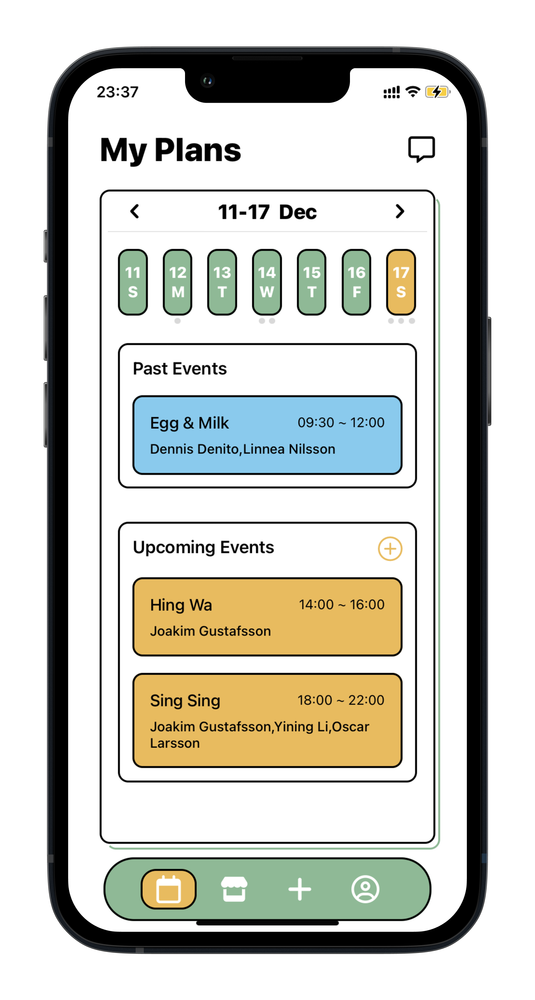
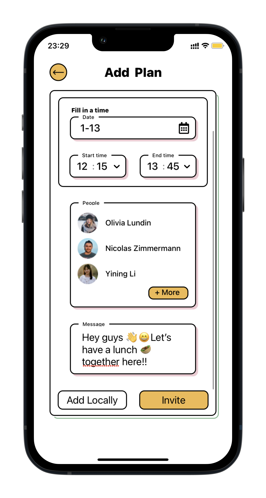
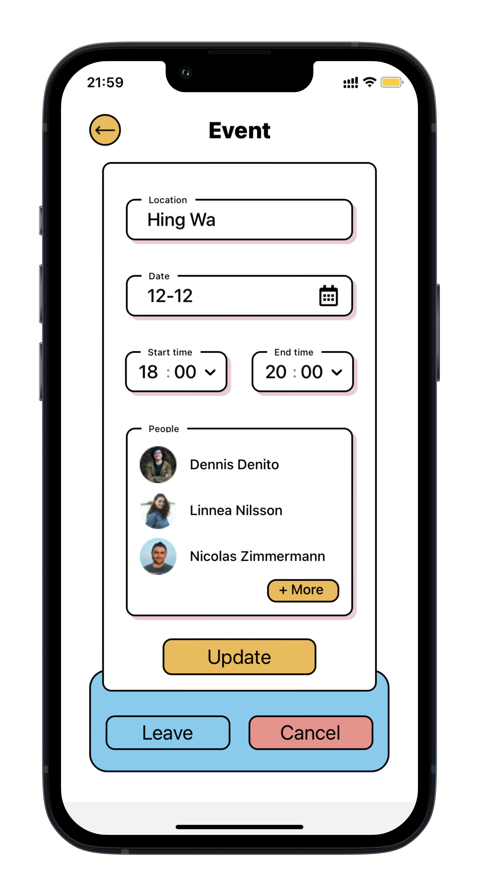

# Code Name: Hangout App "AtPlan"

## Description
As an individual project, the app is developed from scratch for people to share, plan, and manage hangouts.

#### Tech
- React Native
- TypeScript
- Expo
- Hooks

#### Used Design Patterns
- Layout Components
- Higher-Order Components
- Hook Components
- Functional Components

## Modular System Architecture


## Implemented Interfaces
The app's interfaces are related to the 7 system modules, as shown in the picture above.

The UIs of these interfaces were designed by my friend, Yiqian Wu (yiqian@chalmers.se).

### Restaurant Discovery & Restaurant's Home Page
  


### Creating a Post on a Restaurant & Selecting Friends
 

### Calendar, Plan Creation, and Plan Editing
  


### Setup
**First install Node.js LTS:**

	- https://nodejs.org/en/
	(or get it from [here](https://community.chocolatey.org/packages/nodejs-lts) if you use Chocolatey)
	


**Install Expo:**

```bash
npm install -g expo-cli
```

**Clone repo and install dependencies:**

```bash
git clone https://github.com/ArcherMincho/ReactNative-HangoutApp.git
npm install
```

**Run app using [Expo GO](https://expo.dev/client) app:**

```
npx expo start --tunnel
```
